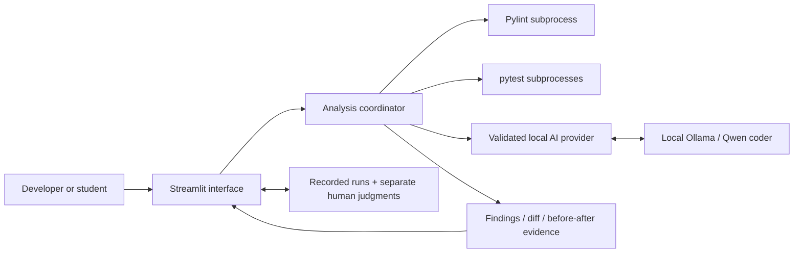

# Architecture

Bug Hunter is one local Python application, not a hosted AI service. Streamlit
binds to loopback (normally port 8501); Ollama serves a separately installed
local model on loopback (normally port 11434). Pylint and pytest use the project's
Python environment. Native Ollama is the default; Docker Ollama is optional.



## Responsibilities

| Component | Source | Responsibility |
| --- | --- | --- |
| Interface | `app.py` | Input, consent, demo selection, model settings, progress, evaluation navigation |
| Coordinator | `bug_hunter/services.py` | Validate input, run independent checks, request AI, evaluate proposed correction |
| AI adapter | `bug_hunter/ai/ollama_provider.py` | Loopback-only discovery/chat, JSON schema, response validation, error states |
| Contracts | `bug_hunter/models.py` | Strict findings and shared result structures |
| Execution | `bug_hunter/analysis/` | Temporary files, bounded subprocesses, lint parsing, pytest counts, strict verification |
| Presentation | `bug_hunter/presentation.py`, `assets/` | Findings, readable timing, code/diff, validation and diagnostics |
| Evaluation | `evaluation/`, `bug_hunter/evaluation_dashboard.py` | 12 controlled cases, immutable raw exports, dashboard and human reviews |
| Setup | `setup_env.py`, `setup.*` | Project-only `.venv` installation and dependency checks |
| Lifecycle | `control.py`, `control.ps1`, `start.*`, `stop.*` | Approved prerequisite/model setup, scoped ownership, repeatable start/stop |
| Verification | `tests/`, `.github/workflows/ci.yml` | Regression checks and real cross-platform CI; no live AI in CI |

## Analysis sequence

```mermaid
sequenceDiagram
    actor User
    participant UI as Streamlit
    participant S as Coordinator
    participant P as Pylint
    participant T as pytest
    participant AI as Local Ollama
    User->>UI: Source + optional tests/context + consent
    UI->>S: Analyze
    S->>S: Validate input
    S->>P: Analyze original source
    P-->>S: Static findings/status
    S->>T: Run supplied tests on original
    T-->>S: Actual counts and logs
    S->>AI: One structured analysis request
    alt Valid model response
        AI-->>S: Findings and proposed full source
        S->>S: Validate schema and source lines
        S->>T: Run identical tests on proposed source
        T-->>S: Actual counts and logs
        S->>S: Apply strict Fix Verified rule
    else Offline / timeout / malformed output
        AI-->>S: Error or unavailable state
        S->>S: Keep independent evidence; no verified fix
    end
    S-->>UI: Results, measured timings, diagnostics
    UI-->>User: Review findings and before/after evidence
```

Original pytest failure output can ground the prompt. Reference fixes are used
only for evaluation controls, never supplied to the model. The model cannot
declare a verified fix; the independent validator computes it from unchanged tests.

## Data and trust boundaries

Source/tests are supplied by the user. The trusted-code acknowledgment is
required before execution. Temporary directories avoid overwriting project
source; subprocess timeouts/output limits prevent some runaway execution.
**They are not a security sandbox:** Python still runs with the account's
permissions and can access its files/network. Only trusted educational inputs
are appropriate. Local inference alone does not make unsafe Python safe.

Model requests accept only HTTP loopback addresses, reject redirects, and do not
use environment proxies. Discovery excludes cloud/remote models. Findings are
validated before display, but schema validity is not factual correctness.
See [the actual prompt/settings](LLM-PROMPT.md).

## Persistence and operation

- `evaluation/recorded/`: original shipped evidence protected by `SHA256.json`.
- `evaluation/results/`: timestamped new CSV/JSON runs, ignored by Git.
- `evaluation/reviews/`: separate, hash-bound human judgments, ignored by Git.
- `.bug-hunter-runtime/`: ignored helper-owned process identities and logs.
- `.venv/`: machine-specific project environment, never distributed or committed.

The managed launcher verifies process identity, creation time, command, and
project location before stopping it. It reuses an existing Ollama service and
leaves that service running. A foreground `run.*` process is stopped with Ctrl+C,
not claimed as owned by `stop.*`.

The optional [Compose environment](../compose.ollama.yml) provides only Ollama;
Python/Streamlit still use the native project helpers. Neither setup method needs
an API key or a paid inference endpoint. Requirements and test traceability are
in [REQUIREMENTS.md](REQUIREMENTS.md).
